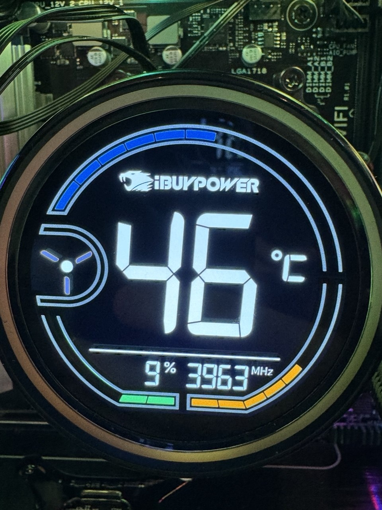

# aw5d-linux

[](https://github.com/claygorman/aw5d-linux/actions/workflows/ci.yml)
[](LICENSE)
[-8A2BE2)](#authorship--ai-disclosure)


Drive the **iBUYPOWER AW5 / AW5D** 360 mm AIO cooler's round LCD from **Linux** —
no Windows, no vendor software.

> [!WARNING]
> **AI-authored · use at your own risk.** The code and documentation in this repository were
> written by **Claude (Anthropic's Claude Code)** working with the author, from black-box
> reverse-engineering of the hardware (details: [Authorship & AI disclosure](#authorship--ai-disclosure)
> and [How this was figured out](RESEARCH.md#how-this-was-figured-out-methodology--tools)).
> It ships **no vendor code**. It's a small, dependency-free, auditable script that only writes
> the documented status report to a `hidraw` device — but it comes with **absolutely no
> warranty**; you run it entirely at your own risk (see [LICENSE](LICENSE)). Read it before you run it.

The AW5D's stock "digital gauge" (big CPU-temperature number, spinning fan,
coloured arc + bars) is drawn and animated by the cooler's own firmware. All the
host has to do is push **one 64-byte USB-HID report per second** with the live
CPU stats. This project does exactly that, reading temperature / usage / clock
straight from the Linux kernel — so the screen just works, natively.



> Status: **working** on an iBUYPOWER unit (`3402:0407`, "CoolerMaster" variant)
> on a Ryzen 7 7800X3D / Bazzite box. The three real readouts — temperature,
> usage, clock — are exact. Contributions/other variants welcome.

## Why this exists

There is (was) **no** Linux support for this cooler in liquidctl, CoolerControl,
or any community project — the vendor only ships a Windows app (HYTE Nexus). The
cooler itself, though, is a plain USB-HID device that Linux can talk to directly.
The full reverse-engineering story and the byte-level protocol are in
[**RESEARCH.md**](RESEARCH.md).

## How it works (short version)

Each ~1 s the driver writes HID **output report `0x10`** (64 bytes) to the
cooler's `hidraw` node:

| offset | field | notes |
|---|---|---|
| 0 | `0x10` | report ID |
| 1 | `0x08` | constant (packet type) |
| 2 | **CPU usage %** | `0–100`, also drives the fan-spin animation |
| 3–4 | **CPU clock (MHz)** | big-endian `uint16` — exact, e.g. `0x0EA9` = 3753 |
| 5 | **CPU temperature °C** | integer — the big on-screen number |
| 9 | blue temperature arc | cosmetic gauge level |
| 10 | orange clock bar | cosmetic gauge level |
| 11 | green usage bar | cosmetic gauge level |
| 12 | `0xF0` / `0xF9` | normal / high-load styling flag |

There is **no handshake, wake, or init packet** — you open the device and write.
Sensors come from sysfs: `k10temp` (Tctl) for temperature, `/proc/stat` for
usage, `cpufreq` for the average core clock. Everything is Python 3 standard
library — no pip dependencies.

## Requirements

- Linux with the cooler on USB (`lsusb` shows `ID 3402:0407`)
- Python 3.8+
- An AMD Ryzen box for the temperature sensor out of the box (`k10temp` /
  `zenpower`); Intel `coretemp` is also probed. Any CPU works if you point
  `--temp-input` at the right `hwmonN/tempN_input`.

## Install

**One-liner:**

```sh
curl -fsSL https://raw.githubusercontent.com/claygorman/aw5d-linux/main/bootstrap.sh | bash
```

**Or clone and review first** (recommended if you'd rather not pipe `curl` to `bash`):

```sh
git clone https://github.com/claygorman/aw5d-linux
cd aw5d-linux
./install.sh          # or, on Bazzite/SteamOS:  just install
```

Either way it drops the driver in `~/.local/share/aw5d-lcd/`, installs a udev rule
so the device is writable without root, and enables a **systemd user service** with
lingering — so the screen updates on boot and keeps going even if you never log in
graphically (or your compositor crashes to the desktop).

Uninstall with `./install.sh --uninstall` (or `just uninstall`).

### Bazzite / SteamOS / atomic distros

This installs cleanly with **no `rpm-ostree` layering and no reboot** — everything
lives in `$HOME` plus a single udev rule in `/etc`, and the cooler's hidraw node is
made user-writable, so the `--user` service can drive it. (There's deliberately **no
Flatpak/app-store build**: a hardware daemon needs raw `/dev/hidraw` access and a
systemd service, which the Flatpak sandbox can't provide.) `just` recipes are included
for the common actions — `just install`, `just status`, `just logs`, `just set-interval 2`.

## Usage

Once installed, the systemd service runs `run` for you — you don't normally invoke the
driver by hand. But it has three commands (handy for setup + troubleshooting):

| Command | What it does |
|---|---|
| `run` *(default)* | drive the LCD in a loop (what the service runs) |
| **`doctor`** | diagnose a dark screen: device present? writable? sensors? service? |
| `list` | print the detected device + sensors, then exit |
| `self-update` | manually fetch the latest, reinstall, and restart (never automatic) |

After install, an **`aw5d-lcd`** command is on your `PATH`:

```sh
# FIRST STOP if the screen is dark — checks device, permissions, sensors, service:
aw5d-lcd doctor

# show just the detected device + sensors:
aw5d-lcd list

# print what would be sent, without touching the device:
aw5d-lcd --dry-run --verbose

# send one frame and exit (a quick "does it light up" test):
aw5d-lcd --once --verbose

# run the live loop by hand (Ctrl-C to stop):
aw5d-lcd --verbose
```

> The command lives at `~/.local/bin/aw5d-lcd` (override the dir with `AW5D_BIN_DIR`, e.g.
> `AW5D_BIN_DIR=/usr/local/bin`). If `aw5d-lcd` isn't found, add `~/.local/bin` to your `PATH`
> or open a fresh shell. Running from a clone *before* installing? Use `python3 aw5d_lcd.py …`
> (or `just doctor`).

Useful flags: `--interval SECONDS`, `--device /dev/hidrawN`,
`--temp-input /sys/class/hwmon/hwmonN/tempN_input`, `--version`.

On Bazzite/SteamOS the same actions are available via `just` — `just doctor`,
`just list`, `just logs`, `just set-interval 2`.

Manage the installed service:

```sh
systemctl --user status aw5d-lcd
systemctl --user restart aw5d-lcd
journalctl --user -u aw5d-lcd -f
```

## Configuration

**Update interval** — how often the driver pushes fresh CPU stats to the LCD (default **1 s**).

> [!NOTE]
> The cooler's firmware re-renders the gauge at **~1 Hz**, so **1 s is the sweet spot**. **2–5 s**
> is perfectly fine and a touch lighter on CPU/USB. **Anything below ~0.5 s just adds USB/CPU
> traffic with no visible benefit** — the panel won't update faster. `0` would busy-loop, so the
> driver clamps it to `0.05 s` and warns.

Three ways to set it (highest precedence first):

```sh
# 1. CLI flag, when running directly:
python3 aw5d_lcd.py --interval 2

# 2. Env var — the installed service reads ~/.config/aw5d-lcd.env:
echo 'AW5D_INTERVAL=2' > ~/.config/aw5d-lcd.env
systemctl --user restart aw5d-lcd

# 3. Or a full systemd override, if you prefer:
#    systemctl --user edit aw5d-lcd   → add [Service] / blank ExecStart= / new ExecStart=…
```

`install.sh` drops a commented `~/.config/aw5d-lcd.env` for you (see
[`aw5d-lcd.env.example`](aw5d-lcd.env.example)); it's never overwritten on re-install.

## Updating

> [!NOTE]
> **This project never auto-updates.** There is no background updater, no systemd timer,
> and no cron job — and the driver itself makes **no network calls** while running (it only
> reads sensors and writes to the LCD). Nothing phones home. `self-update` fetches from the
> network **only** when you run it. You update **only** when *you* choose to.

```sh
# Easiest — the built-in manual updater (fetches latest, reinstalls, restarts the service):
aw5d-lcd self-update

# Or re-run the one-liner:
curl -fsSL https://raw.githubusercontent.com/claygorman/aw5d-linux/main/bootstrap.sh | bash

# Or from a clone:
git pull && ./install.sh          # or:  just update
```

Your `~/.config/aw5d-lcd.env` (interval, etc.) is never overwritten, so your settings
survive updates. To pin a version, just don't run the update — or check out a tag
(`git checkout v1.0.0`).

## Permissions

The udev rule (`udev/99-aw5d-lcd.rules`) sets the AW5D's `hidraw` node to `0666`
so a non-root (and lingering, session-less) service can drive it. It's an
internal cooler display, not a security boundary; adjust the mode/group if your
threat model differs.

## Contributing

Contributions welcome — especially **reports for other AW5-family variants**
(`1029` / `1030`, or anything that isn't `3402:0407`). See
[CONTRIBUTING.md](CONTRIBUTING.md) for how to report a variant and the clean-room rule,
and [RESEARCH.md](RESEARCH.md) for the protocol and how it was reverse-engineered.

## Prior art / thanks

Same idea, other vendors — invaluable references while figuring this out:

- [`Blaster4385/deepcool-display-linux`](https://github.com/Blaster4385/deepcool-display-linux)
- [`Lexonight1/thermalright-trcc-linux`](https://github.com/Lexonight1/thermalright-trcc-linux)
- [`sgtaziz/lian-li-linux`](https://github.com/sgtaziz/lian-li-linux)

## Legal / clean-room note

This is an independent, clean-room reimplementation based on our own
**observations** of how the hardware behaves, for **interoperability**. It
contains **no** vendor code: no decompiled sources, no bundled executables, and
no firmware. "iBUYPOWER", "AW5", "HYTE", and "Nexus" are trademarks of their
respective owners; this project is not affiliated with or endorsed by them.

Use at your own risk. Writing to `hidraw` devices is inherently low-level; while
this only ever sends the small status report described above, no warranty is
provided (see [LICENSE](LICENSE)).

## Authorship & AI disclosure

In the interest of transparency: the **code and documentation in this repository
were written by AI** — Anthropic's Claude (Claude Code, Opus 4.x) — working
interactively with **Clay Gorman**. Clay owns the hardware, directed the
reverse-engineering, captured the USB/HID protocol from the running device, and
tested every result on the physical cooler. The protocol was derived from
black-box observation (see [RESEARCH.md](RESEARCH.md)); Claude authored the
driver, packaging, and docs from that shared investigation.

If you're evaluating this for trust, that's the point of saying so plainly: it's
a small, dependency-free, auditable Python script that only writes the documented
status report to a `hidraw` device. Please read it before you run it.

## License

[MIT](LICENSE) © 2026 Clay Gorman
